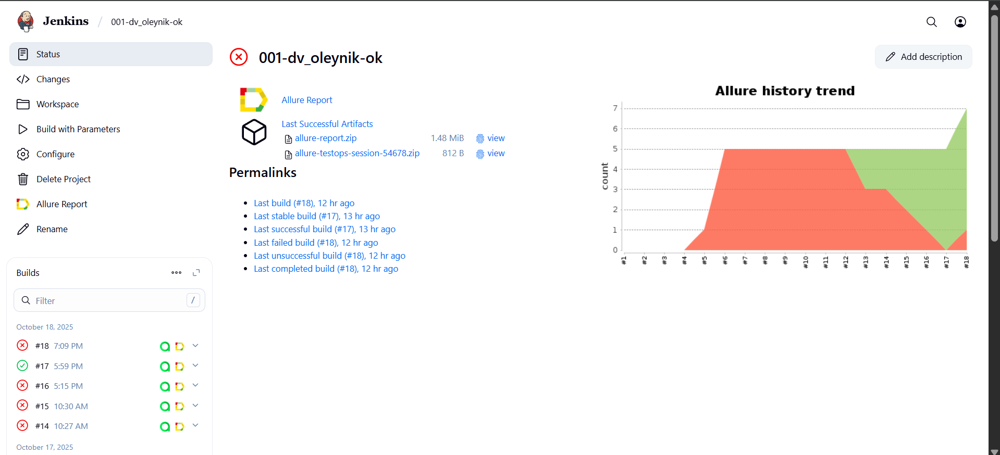

<h1 >Демопроект автотестирования UI на сайте <a href="https://ok.ru/">ОК.RU</a></h1>


## :bookmark_tabs: Содержание

* <a href="#tools">Технологии и инструменты</a>

* <a href="#cases">Реализованные проверки</a>

* <a href="#console">Запуск тестов из терминала</a>

* <a href="#jenkins">Запуск тестов в Jenkins</a>

* <a href="#allure">Отчеты в Allure Report</a>

* <a href="#allure-testops">Интеграция с Allure TestOps</a>

* <a href="#jira">Интеграция с Jira</a>

* <a href="#telegram">Уведомления в Telegram с использованием бота</a>

* <a href="#video">Пример прогона теста в Selenoid</a>

<a id="tools"></a>
## Технологии и инструменты

| Java                                                                                                      | IntelliJ Idea                                                                                                                 | GitHub                                                                                                     | JUnit 5                                                                                                           | Gradle                                                                                                     | Selenide                                                                                                         | Selenoid                                                                                                                  |  Jenkins                                                                                                           |
|:----------------------------------------------------------------------------------------------------------|-------------------------------------------------------------------------------------------------------------------------------|------------------------------------------------------------------------------------------------------------|-------------------------------------------------------------------------------------------------------------------|------------------------------------------------------------------------------------------------------------|------------------------------------------------------------------------------------------------------------------|---------------------------------------------------------------------------------------------------------------------------|-------------------------------------------------------------------------------------------------------------------:|
| <a href="https://www.java.com/"></a>  | <a id ="tech" href="https://www.jetbrains.com/idea/"></a> | <a href="https://github.com/"></a> | <a href="https://junit.org/junit5/"></a> | <a href="https://gradle.org/"></a> | <a href="https://selenide.org/"></a> | <a href="https://aerokube.com/selenoid/"></a> |   <a href="https://www.jenkins.io/"></a> |


| Jira                                                                                                                          | Allure                                                                                                                     | Allure TestOps                                                                                                          |
|:------------------------------------------------------------------------------------------------------------------------------|----------------------------------------------------------------------------------------------------------------------------|-------------------------------------------------------------------------------------------------------------------------|
| <a href="https://www.atlassian.com/ru/software/jira"></a> | <a href="https://github.com/allure-framework"></a> | <a href="https://qameta.io/"></a>    |

<a id="cases"></a>
## :ballot_box_with_check: Реализованные проверки

- :small_blue_diamond: Проверка входа по QR на главной странице
- :small_blue_diamond: Проверка входа через "Не получается войти"
- :small_blue_diamond: Проверка входа через Yandex
- :small_blue_diamond: Попытка входа с некорректными данными почты
- :small_blue_diamond: Попытка входа с некорректными данными телефона
- :small_blue_diamond: Тест входа только по паролю
- :small_blue_diamond: Проверка Support

<a id="console"></a>
## :computer: Запуск тестов из терминала
### Локальный запуск тестов

```
gradle clean test 
```

### Удаленный запуск тестов

```
gradle clean test 
"-Dbrowser=${BROWSER}" 
"-DbrowserVersion=${BROWSER_VERSION}" 
"-DbrowserSize=${BROWSER_SIZE}" 
"-DremoteUrl=${REMOTE_URL}"
```

> `${BROWSER}` - наименование браузера (_по умолчанию - <code>chrome</code>_).
>
> `${BROWSER_VERSION}` - версия браузера (_по умолчанию - <code>128.0</code>_).
>
> `${BROWSER_SIZE}` - размер окна браузера (_по умолчанию - <code>1920x1080</code>_).
>
> `${REMOTE_URL}` - адрес удаленного сервера, на котором будут запускаться тесты.
> 
> <a id="jenkins"></a>
## </a> Запуск тестов в Jenkins

<a target="_blank" href="https://jenkins.autotests.cloud/job/001-dv_oleynik-ok/">Сборка в Jenkins</a>
<p align="center">

<a href="https://jenkins.autotests.cloud/job/001-dv_oleynik-ok/"></a>

> Сборка с параметрами позволяет перед запуском изменить параметры для сборки (путем выбора из списка или прямым указанием значения).
> Клик по иконкам Allure TestOps и Allure Report позволяет перейти на просмотр страниц с тестовой документацией и отчетов.

<a href="https://jenkins.autotests.cloud/job/001-dv_oleynik-ok/"></a>
</p>